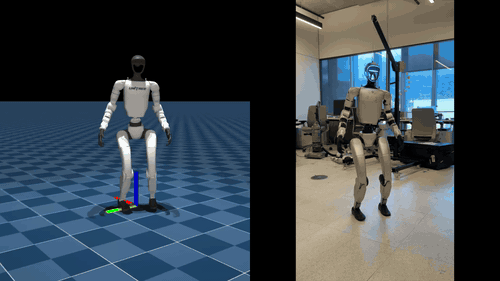
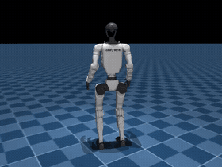

# mjlab example: Unitree G1 Double Spin Kick



An example of building on top of [mjlab](https://github.com/mujocolab/mjlab) to teach a Unitree G1 humanoid to perform a **double spin kick**. The reference motion comes from Jason Peng's [MimicKit](https://github.com/xbpeng/MimicKit).

**This repository provides:**
- Data conversion script (MimicKit pkl → mjlab csv)
- Full training results and hyperparameters
- Pretrained ONNX checkpoint for deployment
- Deployment instructions for real hardware

> ⚠️ **Disclaimer**
>
> This repository is provided as-is for educational purposes. We do not take any responsibility for damage to property or injury to persons that may occur from attempting to replicate the results shown here. Please exercise caution and good judgement when working with hardware.

## Installation

1. Clone mjlab:

```bash
git clone https://github.com/mujocolab/mjlab
```

2. Clone this repo:

```bash
git clone https://github.com/mujocolab/g1_spinkick_example.git
cd g1_spinkick_example
```

3. Install mjlab as an editable package:

```bash
uv add --editable ../mjlab
```

## Data Conversion

Download the spin kick data using the link referenced in the MimicKit [installation instructions](https://github.com/xbpeng/MimicKit?tab=readme-ov-file#installation).

The conversion script adds smooth transitions from a safe standing pose at the start and end of the motion to ensure safe deployment. Since the motion is cyclic, we also repeat it to reach the desired duration.

```bash
# Convert pkl to csv
uv run pkl_to_csv.py \
    --pkl-file g1_spinkick.pkl \
    --csv-file g1_spinkick.csv \
    --duration 2.65 \
    --add-start-transition \
    --add-end-transition \
    --transition-duration 0.5 \
    --pad-duration 1.0

# Convert csv to npz
MUJOCO_GL=egl uv run -m mjlab.scripts.csv_to_npz \
    --input-file g1_spinkick.csv \
    --output-name mimickit_spinkick_safe \
    --input-fps 60 \
    --output-fps 50 \
    --render
```

This will upload the motion to your wandb registry and create a video showing the reference motion like the one below:



## Training

Follow the registry creation instructions in the mjlab [README](https://github.com/mujocolab/mjlab?tab=readme-ov-file#2-motion-imitation).

```bash
MUJOCO_GL=egl CUDA_VISIBLE_DEVICES=0 uv run train.py \
    Mjlab-Spinkick-Unitree-G1 \
    --registry-name {your-organization}/{registry-name}/mimickit_spinkick_safe \
    --env.scene.num-envs 4096 \
    --agent.max-iterations 20_000
```

For full training details and reproducibility, see the [wandb report](https://api.wandb.ai/links/gcbc_researchers/nfi58457).

## Evaluation

To evaluate your trained policy, you'll need your wandb run path. You can find this in the run overview. It follows the format `{your-organization}/{project-name}/{run-id}`, where `run-id` is a unique 8-character identifier.

Once you have your run path, evaluate the policy with:

```bash
uv run play.py \
    Mjlab-Spinkick-Unitree-G1-Play \
    --wandb-run-path {wandb-run-path} \
    --num-envs 8
```

## Deployment

We use [motion_tracking_controller](https://github.com/HybridRobotics/motion_tracking_controller) to deploy the trained policy. An ONNX file is provided for convenience, though one will also be generated in your wandb artifacts. Download it and follow the instructions in the motion_tracking_controller repo.
